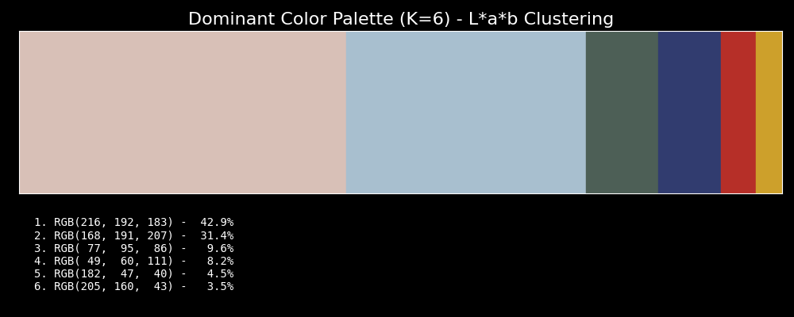
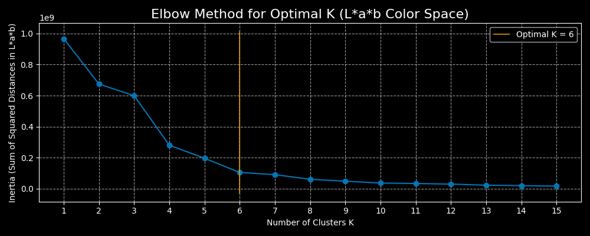

# 🎨 Pix-Palette: K-Means Dominant Color Extractor

This project demonstrates the core concepts of **Unsupervised Machine Learning**, **Feature Engineering**, and **Automated Parameter Optimization** by extracting the dominant color palette from any input image. The goal is to shrink millions of color values to an interpretable and analytically justified few. 

The solution uses the **_K-Means Clustering_** algorithm to group millions of individual pixel colors into a small number of representative colors, which are then displayed in a proportional palette with their RGB values. The key enhancement is the **Autmoated Optimal K-Selection**, which uses the Elbow Method coupled with the **KneeLocator** algorithm to determine the best number of clusters ($K$) for any given image, removing the need for manual inspection.

* Unsupervised Learning: The model works entirely on its own, without needing to be "trained" on pre-labeled data. It discovers the patterns (the clusters of color) inherent in the image data.

* Feature Engineering: The model ignores where a pixel is located (its spatial coordinates) and focus only on its color value, which is the key feature needed to find the color groups. By converting to L\*a\*b color space before clustering, it ensures colors are grouped based on perceptual similarity rather than numerical RGB proximity.

* Automated Optimization & Robustness: The project utilizes a fully automated process to select the optimal $K$. It includes a robust fallback mechanism to ensure a clean palette will still be generated if there is not clear "elbow". 

## ✨ Final Showcase

This section demonstrates the successful Data Reduction from millions of unique colors to an optimized, interpretable palette, powered by an optional **automatic parameter optimization loop**.

### 🎨 Final Optimized Palette ($K$=4)

This section showcases the output of the two modes available: the manual **Default $K$** (for comparison and user-override) and the **Analytically Optimized $K$**. The colors in both palettes are sorted by their frequency (proportion) in the image.

| 1. Default Run ($K$ is Manually Set) | 2. Optimized Run ($K$ is Automatically Chosen) |
| :--- | :--- |
| **Palette Output** | **Palette Output** |
|  |  |
| **Justification:** $K$ is set to a conventional value (e.g., 4), which may not be the optimal fit for the specific image data. | **Justification:** $K$ is set to the value automatically recommended by the KneeLocator algorithm, ensuring the best analytical fit. |

### 📈 Justification: The Automated Optimal $K$ Selection

The **Elbow Method plot** is used to ensure the final $K$ value (number of colors) is analytically justified, not arbitrary.

The plot below shows how the **Inertia** (Sum of Squared Distances in L\*a\*b Space) decreases as the number of clusters $K$ increases. 

| 1. Elbow Plot (Before Automation) | 2. Elbow Plot (After Automation) |
| :--- | :--- |
|  |  |
| The user was previously required to **manually inspect** this curve to visually estimate the optimal point (the "elbow"). | The **KneeLocator algorithm** now automatically identifies this "elbow." The **orange vertical line** marks the exact $K$ value chosen by the routine for the final extraction. |

This robust process (including a safe fallback to a `DEFAULT_K`) ensures the palette extractor is reliable and data-driven for every input image.

## ⚙️ Technical Details

| Component | Technology / Concept | Key Takeaway |
| :--- | :--- | :--- |
| **Algorithm** | K-Means Clustering (Unsupervised Learning) | Learns patterns in data without pre-labeled categories. |
| **Data Prep** | NumPy `reshape` | Converts the 3D image array (Height x Width x L\*a\*b) into a 2D feature vector (Pixels x L\*a\*b). |
| **K-Optimization** | `kneed` (KneeLocator) | Programmatically finds the optimal $K$ value by identifying the "elbow" point in the inertia curve. |
| **Robustness** | Defensive Programming / Fallback Logic | Ensures the extractor uses a `DEFAULT_K` if optimization routine fails to find a clear elbow, guaranteeing a clean result. |
| **Sorting Stability** | Python List Sorting (`lambda`) | Ensures the visual output is consistent across runs by sorting colors based on frequency. |
| **Libraries** | `scikit-learn`, `scikit-image`, `NumPy`, `PIL`, `Matplotlib`, `kneed` | Standard tools for ML model building and visualization in Python. |

## 🚀 How to Run the Project

### Prerequisites

1.  **Python 3.x** installed.
2.  A **Virtual Environment (`venv`)** must be created and activated.
3.  Install dependencies: `pip install numpy Pillow scikit-learn scikit-image matplotlib kneed`
    * Or once you're in the clone repository, `pip install -r requirements.txt`

### Steps

1.  **Clone the Repository:**
    ```bash
    git clone https://github.com/drew-1618/K-Means_image_palette_extractor.git
    cd K-Means_image_palette_extractor
    # Create and activate virtual environment
    python3 -m venv .venv
    source .venv/bin/activate  # On Linux/Mac
    # or
    .venv\Scripts\activate     # On Windows
    ```
2. **Install the Dependencies:**
    ```bash
    pip install -r requirements.txt
    # or manually
    pip install numpy Pillow scikit-learn scikit-image matplotlib kneed
    ```

3.  **Add Your Image:**
    * Create a folder named `images/source/` in the project root.
    * Place your chosen image (e.g., `my_photo.jpg`) inside that folder.

4.  **Run the Notebook:**
    * Open `palette-extractor.ipynb` in VSCode or Jupyter.
    * Update the `IMAGE_PATH` variable to point to your file.
    * Optionally update the `DEFAULT_K` variable and the `IGNORE_OPTIMAL_K` flag to use your choice of K.
    * Run all cells to see the generated palette!

---
### 📝 Project Note
The sample images used for testing the K-Means model stability and source for creating the visuals displayed above were generated by Google's Gemini model.