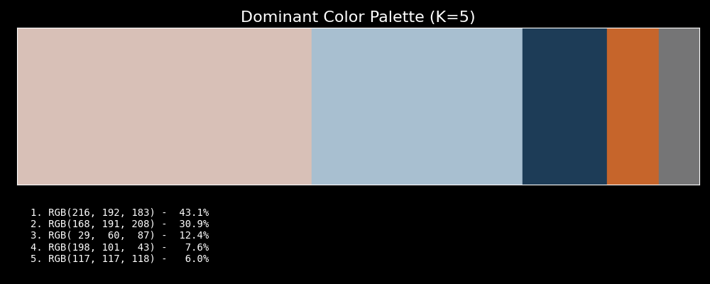
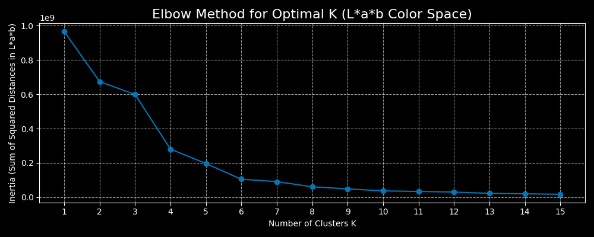

# 🎨 Pix-Palette: K-Means Dominant Color Extractor

This project demonstrates the core concepts of **Unsupervised Machine Learning**, **Feature Engineering**, and **Data Reduction** by automatically extracting the dominant color palette from any input image, shrinking millions of color values to an interpretable few. The solution uses the **_K-Means Clustering_** algorithm to group millions of individual pixel colors into a specified number of representative colors, which are then displayed in a proportional palette with their RGB values. To ensure the palette is optimal, the project utilizes the Elbow Method to analytically determine the best number of clusters (K) for any given image.

* Unsupervised Learning: The model works entirely on its own, without needing to be "trained" on pre-labeled data. It discovers the patterns (the clusters of color) inherent in the image data.

* Feature Engineering: The model ignores where a pixel is located (its spatial coordinates) and focus only on its color value, which is the key feature needed to find the color groups. By converting to L\*a\*b color space before clustering, it ensures colors are grouped based on perceptual similarity rather than numerical RGB proximity.

* Data Reduction: The project shrinks a massive dataset (millions of colors) down to a small, meaningful set of colors (K=4), which is a core task in machine learning and data analysis.

## ✨ Final Showcase

This section demonstrates the successful Data Reduction from millions of unique colors to an optimized, interpretable palette.

### 🎨 Final Optimized Palette (K=4)

Here is the dominant color palette extracted from a sample input image, with the final K value determined analytically by the Elbow Method. The colors are sorted by their frequency (proportion) in the image:



### 📈 Justification: Optimal K Selection

Use the **Elbow Method** to ensure the K value (number of colors) is analytically justified, not arbitrary.

The plot below shows how the **Inertia** (Sum of Squared Distances in L\*a\*b Space) decreases as the number of clusters K increases. 

The point where the curve bends (the "elbow") indicates that adding more clusters provides diminishing returns on fitting the data.

In this specific case, the elbow occurs within K=4 to K=6 (depending on the granularity desired), confirming that four colors provides a great balance between model simplicity and data representation.



## ⚙️ Technical Details

| Component | Technology / Concept | Key Takeaway |
| :--- | :--- | :--- |
| **Algorithm** | K-Means Clustering (Unsupervised Learning) | Learns patterns in data without pre-labeled categories. |
| **Data Prep** | NumPy `reshape` | Converts the 3D image array (Height x Width x L\*a\*b) into a 2D feature vector (Pixels x L\*a\*b). |
| **Sorting Stability** | Python List Sorting (`lambda`) | Ensures the visual output is consistent across runs by sorting colors based on frequency. |
| **Libraries** | `scikit-learn`, `scikit-image`, `NumPy`, `PIL`, `Matplotlib` | Standard tools for ML model building and visualization in Python. |

## 🚀 How to Run the Project

### Prerequisites

1.  **Python 3.x** installed.
2.  A **Virtual Environment (`venv`)** must be created and activated.
3.  Install dependencies: `pip install numpy Pillow scikit-learn scikit-image matplotlib`
    * Or once you're in the clone repository, `pip install -r requirements.txt`

### Steps

1.  **Clone the Repository:**
    ```bash
    git clone https://github.com/drew-1618/K-Means_image_palette_extractor.git
    cd K-Means_image_palette_extractor
    # Create and activate virtual environment
    python3 -m venv .venv
    source .venv/bin/activate  # On Linux/Mac
    # or
    .venv\Scripts\activate     # On Windows
    ```
2. **Install the Dependencies:**
    ```bash
    pip install -r requirements.txt
    # or manually
    pip install numpy Pillow scikit-learn scikit-image matplotlib
    ```

3.  **Add Your Image:**
    * Create a folder named `images/source/` in the project root.
    * Place your chosen image (e.g., `my_photo.jpg`) inside that folder.

4.  **Run the Notebook:**
    * Open `palette-extractor.ipynb` in VSCode or Jupyter.
    * Update the `IMAGE_PATH` variable to point to your file.
    * Run all cells to see the generated palette!

---
### 📝 Project Note
The sample images used for testing the K-Means model stability and source for creating the visuals displayed above were generated by Google's Gemini model.